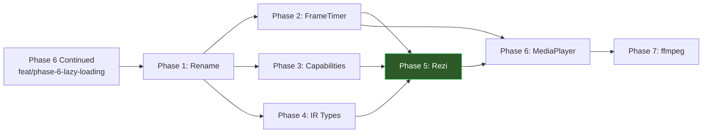

# Media Architecture: FrameTimer, MediaPlayer, and Audio/Video IR

## Enhancement Summary

**Deepened on:** 2026-03-06
**Sections enhanced:** FrameTimer, IR compilation, dependency graph, Rezi integration
**Research agents used:** TypeScript reviewer, Architecture strategist, Performance oracle, Security sentinel, Pattern recognition, Frontend races reviewer, Code simplicity reviewer

### Key Improvements from Deepening

1. **Rezi renderer phase added (Phase 5)** — stacked branch after core media layer lands. Rezi's `ui.image()` accepts binary RGBA directly from the decoder. `ui.canvas()` available for low-level raster. State-driven rendering (no React reconciler tearing) enables animated GIF natively.
2. **FrameTimer `play()` resume bug fixed** — original code reset `epochMs`/`accumulated` on every `play()`, defeating drift correction on pause→resume. Fixed: only reset on idle/ended→playing.
3. **FrameTimer needs `'ended'` state** — non-loop playback set `state = 'paused'` at last frame, but "paused" implies resumable. Added `'ended'` to `PlaybackState` to match `MediaPlayerState`.
4. **`CompilerState.basePath` doesn't exist** — `compileVideo`/`compileAudio` called `sanitizeMediaSrc(src, state.basePath)` but `CompilerState` has no `basePath`. Fixed: drop `basePath` parameter, match existing `sanitizeImageSrc()` signature.
5. **Unsafe `as` casts on hast properties** — plan used `node.properties?.src as string | undefined`. Fixed: use runtime `typeof` check first (matches existing `compileAnchor` pattern).
6. **`detectMediaType` fragile for URLs with query strings** — `video.mp4?token=abc` would not match. Fixed: strip query/fragment before extension check.
7. **`DecodeOptions` vs actual `decodeImage` signature** — plan's options object doesn't match existing 7-parameter function. Noted: migrate to options object in same commit (7 positional params violates readability).
8. **`ffmpegAvailable: null` vs existing `undefined` pattern** — changed to `boolean | undefined` to match `initSharp()`.
9. **Phase dependency graph restructured** — Phases 1-4 (core) merge to main, then Rezi stacks as branch before MediaPlayer/ffmpeg.

### New Considerations Discovered

- **Rezi has `ui.image({ source: binaryPayload })` for RGBA rendering** — no half-block conversion needed, direct pixel data
- **Rezi's animation hooks (`useTransition`, `useSpring`)** exist but FrameTimer is still needed for GIF-specific per-frame delays
- **Rezi uses `app.update()` for state batching** — FrameTimer `onFrame` callback triggers `app.update()` to swap frame, no reconciler tearing
- **GIF animation was attempted in OpenTUI, hit React reconciler tearing, reverted to static** (commit history confirms brainstorm decision #6)

---

## Overview

Build a renderer-agnostic media layer that extends the existing image pipeline to support animated GIF playback on capable renderers, with an architecture that naturally extends to audio and video playback. The core owns playback timing and decoded frames; renderers own display and controls.

This plan covers: renaming `src/image/` to `src/media/`, extracting a `FrameTimer` utility, defining `MediaCapabilities` and `MediaPlayer` interfaces, adding `VideoNode`/`AudioNode` IR types with pipeline compilation, and ffmpeg as an optional lazy dependency.

## Problem Statement

The current image pipeline (`src/image/`) handles static images and animated GIFs, but:

1. **GIF animation is renderer-coupled** — frame cycling logic lives inside `ImageBlock` (OpenTUI component). A future renderer (Rezi) cannot reuse the timer or frame management.
2. **No media type extensibility** — the IR has only `ImageNode`. Video and audio have no representation, no compilation path, and no rendering strategy.
3. **Animation timing drifts** — the current `setTimeout` chain in `ImageBlock` accumulates drift. Over 20+ frames this is visibly noticeable.
4. **Memory limits are hardcoded** — `MAX_GIF_FRAMES = 20` and `MAX_GIF_DECODED_BYTES = 10MB` are constants. Renderers with different memory budgets (e.g., Rezi with direct buffer control) cannot override them.
5. **Directory naming is misleading** — `src/image/` contains GIF animation logic, remote fetching, and resource management that applies to all media types, not just images.

## Proposed Solution

A layered media architecture where:

- **`src/media/`** is the shared, renderer-agnostic media layer (renamed from `src/image/`)
- **`FrameTimer`** provides drift-correcting frame cycling as a reusable utility
- **`MediaCapabilities`** tells the core what each renderer supports
- **`MediaPlayer`** coordinates frame delivery, playback state, and audio bridging
- **IR nodes** (`VideoNode`, `AudioNode`) give renderers type-safe dispatch
- **ffmpeg** is a lazy optional dependency for decoding video frames and playing audio

(see brainstorm: `docs/brainstorms/2026-03-06-media-rendering-brainstorm.md`)

## Technical Approach

### Architecture

```
src/media/                          # renamed from src/image/
  types.ts                          # LoadedImage, MediaCapabilities, PlaybackState, LoadedFile
  detect.ts                         # combined theme + media capability detection
  loader.ts                         # local file loading
  fetcher.ts                        # remote fetch with SSRF mitigations
  decoder.ts                        # sharp: image + GIF decode
  halfblock.ts                      # RGBA → styled character grid
  kitty.ts                          # Kitty protocol escape sequences
  cache.ts                          # LRU memory cache (50MB)
  semaphore.ts                      # createSemaphore() utility
  frame-timer.ts                    # drift-correcting frame cycling (NEW)
  media-player.ts                   # frame delivery + playback state (NEW)
  ffmpeg.ts                         # lazy ffmpeg detection + child process (NEW)

src/ir/types.ts                     # add VideoNode, AudioNode to CoreIRNode union

src/pipeline/
  rehype-ir.ts                      # add video/audio compilation
  sanitize-media-src.ts             # media URL sanitizer (NEW, reuses image pattern)

src/renderer/opentui/
  image.tsx                         # static GIF (unchanged behavior)
  video.tsx                         # video component — text fallback initially (NEW)
  audio.tsx                         # audio component — text fallback initially (NEW)
  media-controls.tsx                # playback controls (NEW, future)

src/renderer/rezi/                  # Phase 5 — stacked branch (NEW)
  boot.ts                           # createNodeApp, state type, start/stop
  app.ts                            # view function, state management
  dispatch.ts                       # IR node → Rezi widget mapping
  components/                       # per-node-type renderers
    heading.ts, paragraph.ts, code-block.ts, blockquote.ts,
    list.ts, table.ts, image.ts, thematic-break.ts, inline.ts
```

### Data Flow

```
Animated GIF (capable renderer):
  markdown → rehype-ir → ImageNode (frames[] on LoadedImage)
    → FrameTimer subscribes to delays
    → renderer swaps displayed frame on each tick
    → memory pressure callback controls decode depth

Video (future):
  markdown → rehype-ir → VideoNode
    → MediaPlayer.load(url)
      → initFFmpeg() → spawn: extract RGBA frames as stream
      → spawn ffplay: audio (headless)
      → FrameTimer: sync frame display to audio position
    → renderer: display frame + controls

Audio (future):
  markdown → rehype-ir → AudioNode
    → MediaPlayer.load(url)
      → initFFmpeg() → spawn ffplay (headless)
      → position/duration tracking
    → renderer: controls UI only (no pixels)
```

### Implementation Phases

---

#### Phase 1: Directory Rename (`src/image/` → `src/media/`)

Pure mechanical rename. One atomic commit with no functional changes.

##### 1a. Rename directory and update imports

Move `src/image/` to `src/media/`. Update every import path across the codebase.

**Files to rename:**

```
src/image/types.ts        → src/media/types.ts
src/image/detect.ts       → src/media/detect.ts
src/image/loader.ts       → src/media/loader.ts
src/image/fetcher.ts      → src/media/fetcher.ts
src/image/decoder.ts      → src/media/decoder.ts
src/image/halfblock.ts    → src/media/halfblock.ts
src/image/kitty.ts        → src/media/kitty.ts
src/image/cache.ts        → src/media/cache.ts
src/image/semaphore.ts    → src/media/semaphore.ts
src/image/*.test.ts       → src/media/*.test.ts
```

**Import consumers to update:**

```
src/cli/index.ts                    # detect, types
src/renderer/opentui/image.tsx      # types, halfblock, kitty, cache, decoder, loader, fetcher
src/renderer/opentui/image-context.tsx  # types
src/renderer/opentui/app.tsx        # detect, types, cache
src/renderer/opentui/boot.tsx       # detect (if imported)
src/pipeline/rehype-ir.ts           # sanitize-image-src
src/pipeline/sanitize-image-src.ts  # stays in pipeline (sanitization is pipeline concern)
```

**Approach:** `git mv src/image src/media` preserves history. Then fix imports with a project-wide find-and-replace of `../image/` → `../media/` and `../../image/` → `../../media/`.

##### 1b. Update documentation references

Update `MEMORY.md`, `CLAUDE.md` project notes, and any docs referencing `src/image/`.

##### Phase 1 acceptance criteria

- [ ] `src/image/` no longer exists
- [ ] `src/media/` contains all former `src/image/` files
- [ ] All imports resolve correctly
- [ ] All existing tests pass (342+), lint clean
- [ ] `git log --follow src/media/types.ts` shows full history
- [ ] Zero functional changes — diff is purely path updates

---

#### Phase 2: FrameTimer (`src/media/frame-timer.ts`)

Drift-correcting frame cycling utility. Pure function, no renderer dependencies, no React imports.

##### 2a. FrameTimer API

```typescript
// src/media/frame-timer.ts

type PlaybackState = 'idle' | 'playing' | 'paused' | 'ended'

interface FrameTimerHandle {
    play(): void
    pause(): void
    seek(frameIndex: number): void
    dispose(): void
    readonly state: PlaybackState
    readonly currentFrame: number
}

interface FrameTimerOptions {
    delays: number[]
    onFrame: (index: number) => void
    loop?: boolean  // default: true (GIFs loop, videos don't)
}

function createFrameTimer(options: FrameTimerOptions): FrameTimerHandle
```

##### 2b. Drift correction algorithm

The core insight (see brainstorm): `setTimeout(fn, delay)` drifts because it schedules relative to callback execution time, not absolute wall-clock time. A `FrameTimer` measures elapsed time and adjusts:

```typescript
function createFrameTimer({ delays, onFrame, loop = true }: FrameTimerOptions): FrameTimerHandle {
    let state: PlaybackState = 'idle'
    let frameIndex = 0
    let timerId: ReturnType<typeof setTimeout> | null = null
    let epochMs = 0       // wall-clock time when current frame started
    let accumulated = 0   // total elapsed ms from frame 0 to current frame start

    function scheduleNext() {
        if (state !== 'playing') return
        const delay = delays[frameIndex] ?? 100
        const now = performance.now()
        const expected = epochMs + accumulated + delay
        const adjusted = Math.max(0, expected - now)

        timerId = setTimeout(() => {
            accumulated += delay
            frameIndex = loop
                ? (frameIndex + 1) % delays.length
                : Math.min(frameIndex + 1, delays.length - 1)

            if (!loop && frameIndex === delays.length - 1) {
                state = 'ended'
                onFrame(frameIndex)
                return
            }
            onFrame(frameIndex)
            scheduleNext()
        }, adjusted)
    }

    return {
        play() {
            if (state === 'playing') return
            if (state === 'idle' || state === 'ended') {
                accumulated = 0
                frameIndex = 0
            }
            // anchor epoch so drift correction accounts for time already elapsed
            epochMs = performance.now() - accumulated
            state = 'playing'
            onFrame(frameIndex)
            scheduleNext()
        },
        pause() {
            if (state !== 'playing') return
            state = 'paused'
            if (timerId != null) { clearTimeout(timerId); timerId = null }
        },
        seek(index: number) {
            frameIndex = Math.max(0, Math.min(index, delays.length - 1))
            accumulated = delays.slice(0, frameIndex).reduce((a, b) => a + b, 0)
            epochMs = performance.now()
            onFrame(frameIndex)
            if (state === 'playing') {
                if (timerId != null) { clearTimeout(timerId); timerId = null }
                scheduleNext()
            }
        },
        dispose() {
            state = 'idle'
            if (timerId != null) { clearTimeout(timerId); timerId = null }
        },
        get state() { return state },
        get currentFrame() { return frameIndex },
    }
}
```

**Why not `requestAnimationFrame`:** Not available in terminal renderers. `setTimeout` with drift correction achieves the same visual quality for 10-20fps GIF animation.

**Why per-frame `setTimeout` (not `setInterval`):** GIF frames have per-frame delays. `setInterval` assumes constant interval.

##### 2c. Integration point

The existing `ImageBlock` frame cycling code (Phase 6 continued, Phase 3c) can be refactored to use `createFrameTimer()` instead of inline `setTimeout` + `useEffect`. This is a clean swap — the component creates a timer on mount, disposes on unmount, and the `onFrame` callback calls `setFrameIndex`.

For Rezi (future): the renderer creates a `FrameTimer`, subscribes to `onFrame`, and swaps its frame buffer directly — no React reconciler involved.

**Files:** `src/media/frame-timer.ts` (new), `src/media/frame-timer.test.ts` (new)
**Tests:** play/pause transitions, seek clamps to bounds, drift correction (mock `performance.now`), dispose clears timer, loop wraps index, non-loop stops at last frame, zero-delay handling
**Effort:** ~80 lines implementation, ~100 lines tests

##### Phase 2 acceptance criteria

- [ ] `createFrameTimer()` exported from `src/media/frame-timer.ts`
- [ ] Drift correction: over 20 frames, accumulated error < 1 frame delay
- [ ] `play()` → `pause()` → `play()` resumes from correct frame
- [ ] `seek(n)` jumps to frame n, adjusts accumulated time
- [ ] `dispose()` clears all timers, no leaked timeouts
- [ ] `loop: true` wraps index at end, `loop: false` transitions to `'ended'` state
- [ ] `play()` after `'ended'` restarts from frame 0
- [ ] `play()` after `'paused'` resumes from current frame (no drift reset)
- [ ] `state` and `currentFrame` must be read via property access (not destructured)
- [ ] No renderer dependencies (pure utility)
- [ ] All tests pass, lint clean

### Research Insight: FrameTimer play() resume

The original `play()` implementation reset `epochMs` and `accumulated` on every call. This broke pause→resume: drift correction math restarted from zero, causing the first post-resume frame to fire immediately (expected - now is negative). Fixed: only reset on idle/ended→playing transitions. On paused→playing, anchor epoch relative to accumulated time so drift correction continues smoothly.

---

#### Phase 3: MediaCapabilities + Memory Pressure Callback

##### 3a. MediaCapabilities type

Extend the existing `ImageCapabilities` to cover animation and future media:

```typescript
// src/media/types.ts

interface MediaCapabilities extends ImageCapabilities {
    canAnimate: boolean    // can the renderer swap frames without tearing?
    canPlayAudio: boolean  // can the environment play audio? (future)
}
```

**Detection:** `canAnimate` is `false` for OpenTUI (React reconciler tearing), `true` for Rezi (direct buffer writes). `canPlayAudio` is `true` when `ffmpeg`/`ffplay` is detected (future Phase 7).

For now, `canAnimate` is always `false` (only OpenTUI exists). The flag is defined so Rezi can set it to `true` without changing the interface.

**Files:** `src/media/types.ts`
**Effort:** ~5 lines

##### 3b. Memory pressure callback

Replace hardcoded `MAX_GIF_FRAMES` and `MAX_GIF_DECODED_BYTES` with a `shouldContinue()` callback passed to the decoder:

```typescript
// src/media/decoder.ts — updated signature
interface DecodeOptions {
    bytes: Uint8Array
    targetWidth: number
    source: string
    shouldContinue?: () => boolean  // called after each frame decode
}

async function decodeImage(options: DecodeOptions): Promise<ImageResult<LoadedImage>>
```

Inside the decode loop:

```typescript
for (let i = 0; i < frameCount; i++) {
    // ... decode frame ...
    frames.push(buf)
    totalDecoded += buf.byteLength

    // check memory pressure after each frame
    if (options.shouldContinue != null && !options.shouldContinue()) break
}
```

**Renderer implementations:**

- OpenTUI: `() => frames.length < 20 && totalDecoded < 10 * 1024 * 1024` (same limits as today)
- Rezi (future): `() => true` (unlimited — direct buffer control, no GC pressure)

**Backward compatibility:** `shouldContinue` is optional. When omitted, the decoder uses the existing hardcoded limits as a safe default. Existing call sites don't need changes.

**Migration note:** The existing `decodeImage()` has 7 positional parameters (bytes, targetCols, cellPixelWidth, cellPixelHeight, purpose, source, animationLimits). Migrate to an options object in the same commit — 7 positional params is unreadable. The `DecodeOptions` interface replaces all positional params, not just adds `shouldContinue`. Update all call sites (decoder.test.ts, use-image-loader.ts).

**Files:** `src/media/decoder.ts`, `src/media/decoder.test.ts`, `src/renderer/opentui/use-image-loader.ts`
**Tests:** Callback called after each frame, `false` stops decode early, omitted callback uses defaults
**Effort:** ~30 lines changed (including call site migration)

##### Phase 3 acceptance criteria

- [ ] `MediaCapabilities` extends `ImageCapabilities` with `canAnimate` and `canPlayAudio`
- [ ] `shouldContinue()` callback stops decode loop when returning `false`
- [ ] Existing call sites work without changes (optional parameter)
- [ ] Default behavior unchanged (hardcoded limits as fallback)
- [ ] All tests pass, lint clean

---

#### Phase 4: VideoNode + AudioNode IR Types + Pipeline

##### 4a. IR node types

Add `VideoNode` and `AudioNode` to the discriminated union in `src/ir/types.ts`:

```typescript
// src/ir/types.ts

interface VideoNode {
    type: 'video'
    alt: string          // from poster alt or fallback text
    src?: string         // sanitized URL
    href?: string        // wrapping link (same pattern as ImageNode)
    poster?: string      // poster frame URL
    autoplay: boolean    // from <video autoplay> attribute
    loop: boolean        // from <video loop> attribute
    style: InlineStyle
}

interface AudioNode {
    type: 'audio'
    alt: string          // description text
    src?: string         // sanitized URL
    autoplay: boolean    // from <audio autoplay> attribute — follows HTML semantics
    loop: boolean        // from <audio loop> attribute
    style: InlineStyle
}
```

Add both to `CoreIRNode` union:

```typescript
export type CoreIRNode =
    | AudioNode      // NEW
    | BlockquoteNode
    | BreakNode
    // ...
    | VideoNode      // NEW
    // ...
```

Add `'video'` and `'audio'` to `BLOCK_TYPES` set (they render as blocks, like `'image'`).

**Files:** `src/ir/types.ts`
**Effort:** ~30 lines

##### 4b. Pipeline compilation

Add `compileVideo` and `compileAudio` handlers to `rehype-ir.ts`:

```typescript
// src/pipeline/rehype-ir.ts — in BLOCK_COMPILERS or customHandlers

function compileVideo(state: CompilerState, node: Element): VideoNode | null {
    // runtime type check — hast properties can be string | number | boolean | array
    const rawSrc = node.properties?.['src']
    const src = typeof rawSrc === 'string' ? sanitizeMediaSrc(rawSrc) : undefined
    const rawAlt = node.properties?.['alt']
    const alt = typeof rawAlt === 'string' ? rawAlt : ''
    const autoplay = node.properties?.['autoplay'] != null
    const loop = node.properties?.['loop'] != null
    const rawPoster = node.properties?.['poster']
    const poster = typeof rawPoster === 'string' ? sanitizeMediaSrc(rawPoster) : undefined

    return {
        type: 'video',
        alt: alt.length > 0 ? alt : 'video',
        ...(src != null ? { src } : {}),
        ...(poster != null ? { poster } : {}),
        autoplay,
        loop,
        style: {},
    }
}

function compileAudio(state: CompilerState, node: Element): AudioNode | null {
    const rawSrc = node.properties?.['src']
    const src = typeof rawSrc === 'string' ? sanitizeMediaSrc(rawSrc) : undefined
    const rawAlt = node.properties?.['alt']
    const alt = typeof rawAlt === 'string' ? rawAlt : ''
    const autoplay = node.properties?.['autoplay'] != null
    const loop = node.properties?.['loop'] != null

    return {
        type: 'audio',
        alt: alt.length > 0 ? alt : 'audio',
        ...(src != null ? { src } : {}),
        autoplay,
        loop,
        style: {},
    }
}
```

Register in `customHandlers`:

```typescript
video: (state, node) => compileVideo(state, node),
audio: (state, node) => compileAudio(state, node),
```

##### 4c. Auto-detection from image syntax

`` should produce a `VideoNode`, not an `ImageNode`. Detect in `compileImage()`:

```typescript
// inside compileImage, after sanitizing src
const mediaType = detectMediaType(src)
if (mediaType === 'video') return compileVideoFromImg(state, node, src)
if (mediaType === 'audio') return compileAudioFromImg(state, node, src)
// ... existing ImageNode path
```

**Detection strategy:** Extension-based first, magic bytes as future enhancement (requires fetching the file before compilation, which is not how the pipeline works — pipeline is synchronous).

```typescript
const VIDEO_EXTENSIONS = new Set(['.mp4', '.webm', '.mov', '.avi', '.mkv'])
const AUDIO_EXTENSIONS = new Set(['.mp3', '.wav', '.ogg', '.flac', '.aac', '.m4a'])

function detectMediaType(src: string): 'image' | 'video' | 'audio' {
    const dotIndex = src.lastIndexOf('.')
    if (dotIndex === -1) return 'image'
    // strip query string and fragment before extension check
    const afterDot = src.slice(dotIndex)
    const ext = afterDot.split(/[?#]/)[0]!.toLowerCase()
    if (VIDEO_EXTENSIONS.has(ext)) return 'video'
    if (AUDIO_EXTENSIONS.has(ext)) return 'audio'
    return 'image'
}
```

**Edge case — wrong extension:** If `file.mp4` is actually an image, ffmpeg will fail at decode time → graceful fallback to `[video: alt]` text. The pipeline cannot verify content at compile time (no I/O in the compiler). This matches how `ImageNode` works — invalid images fall back to `[image: alt]`.

##### 4d. Media source sanitization

New `src/pipeline/sanitize-media-src.ts` reusing the pattern from `sanitize-image-src.ts`:

```typescript
// src/pipeline/sanitize-media-src.ts
export function sanitizeMediaSrc(
    src: string | undefined,
    basePath: string,
): string | undefined {
    // same logic as sanitizeImageSrc — relative paths + http/https allowlist
    // reuse or import sanitizeImageSrc directly if the rules are identical
}
```

If the validation rules are identical to `sanitizeImageSrc`, just re-export it:

```typescript
export { sanitizeImageSrc as sanitizeMediaSrc } from './sanitize-image-src.js'
```

**Files:** `src/ir/types.ts`, `src/pipeline/rehype-ir.ts`, `src/pipeline/sanitize-media-src.ts` (new or re-export)
**Tests:** `<video>` compiles to VideoNode, `<audio>` compiles to AudioNode, `` produces VideoNode, extension detection, sanitization
**Effort:** ~80 lines

##### 4e. Paragraph promotion for video/audio

Standalone `<video>` or `<audio>` inside a paragraph should be promoted out (same as images):

```typescript
// inside compileParagraph
const firstChild = children[0]
if (children.length === 1 && (firstChild?.type === 'image' || firstChild?.type === 'video' || firstChild?.type === 'audio')) {
    return firstChild
}
```

##### Phase 4 acceptance criteria

- [ ] `VideoNode` and `AudioNode` in `CoreIRNode` union
- [ ] `<video src="...">` compiles to `VideoNode`
- [ ] `<audio src="...">` compiles to `AudioNode`
- [ ] `autoplay` and `loop` attributes threaded through
- [ ] `` auto-detects as `VideoNode`
- [ ] `` auto-detects as `AudioNode`
- [ ] Extension detection covers common formats
- [ ] Unknown extensions stay as `ImageNode`
- [ ] Media sources sanitized (same rules as image sources)
- [ ] Standalone video/audio promoted out of paragraphs
- [ ] Both added to `BLOCK_TYPES` set
- [ ] `exactOptionalPropertyTypes` compliant (spread for optional fields)
- [ ] All tests pass, lint clean

---

#### Phase 5: Rezi Renderer (`src/renderer/rezi/`) — Stacked Branch

**Branch: `feat/rezi-renderer` stacked on top of `feat/media-core` (Phases 1-4)**

Implement Rezi as the second renderer, proving the renderer-agnostic media architecture works. Rezi's state-driven model eliminates the React reconciler tearing that forced OpenTUI to static-only GIFs.

**Why now:** The core media layer (FrameTimer, MediaCapabilities) is designed for multiple renderers. Building Rezi before MediaPlayer validates the architecture with a real consumer. It also unblocks animated GIF playback — the primary motivation from the brainstorm.

##### 5a. Rezi app scaffold

```typescript
// src/renderer/rezi/boot.ts
import { createNodeApp } from '@rezi-ui/node'

interface ReziAppState {
    content: IRNode[]
    scrollY: number
    // ... viewer state
}

const app = createNodeApp<ReziAppState>({
    initialState: { content: [], scrollY: 0 },
})
```

Rezi uses `app.view(state => ...)` — the view is a pure function of state. No React hooks, no reconciler. State updates via `app.update()` are batched and coalesced.

**Dependencies:** `@rezi-ui/core`, `@rezi-ui/node` (add to package.json)

##### 5b. Component dispatch

Map IR node types to Rezi widgets. Follow the existing `BLOCK_COMPILERS`/`INLINE_COMPILERS` dispatch pattern:

```typescript
// src/renderer/rezi/dispatch.ts
import { ui } from '@rezi-ui/core'

const REZI_BLOCK_RENDERERS: Record<string, (node: IRNode, state: ReziRenderState) => VNode> = {
    heading: renderHeading,
    paragraph: renderParagraph,
    codeBlock: renderCodeBlock,
    blockquote: renderBlockquote,
    list: renderList,
    table: renderTable,
    thematicBreak: renderThematicBreak,
    image: renderImage,
    video: renderVideo,     // text fallback initially
    audio: renderAudio,     // text fallback initially
}
```

Rezi primitives mapping:
- `ui.text()` → text content with styling
- `ui.box()` → bordered containers (blockquotes, code blocks)
- `ui.row()` / `ui.column()` → layout
- `ui.richText()` → inline styled spans
- `ui.divider()` → thematic breaks
- `ui.image()` → binary RGBA image rendering

##### 5c. Image rendering via `ui.image()`

Rezi's `ui.image()` accepts binary RGBA directly — no half-block conversion needed:

```typescript
function renderImage(node: ImageNode, state: ReziRenderState): VNode {
    const image = state.imageCache.get(node.url)
    if (image == null) return ui.text(`[loading: ${node.alt}]`)
    if (!image.ok) return ui.text(`[image: ${node.alt}]`)

    return ui.image({
        source: image.value.rgba,  // direct RGBA buffer
        width: image.value.terminalCols,
        height: image.value.terminalRows,
    })
}
```

This bypasses `halfblock.ts` entirely — Rezi handles pixel-to-cell mapping natively via its Zireael C engine. Kitty protocol support depends on Rezi's built-in terminal image protocol detection.

##### 5d. Animated GIF via FrameTimer

This is the key integration. Rezi's state-driven model + FrameTimer = tear-free animation:

```typescript
// animated GIF state tracked in app state
interface GifAnimationState {
    frameIndex: number
    timer: FrameTimerHandle | null
}

function startGifAnimation(image: LoadedImage, imageKey: string): void {
    if (image.frames == null || image.delays == null) return

    const timer = createFrameTimer({
        delays: image.delays,
        onFrame: (index) => {
            // app.update() is batched — no tearing
            app.update((s) => ({
                ...s,
                gifFrames: { ...s.gifFrames, [imageKey]: index },
            }))
        },
        loop: true,
    })
    timer.play()
}

// in the view function, read the current frame index from state
function renderAnimatedImage(node: ImageNode, state: ReziAppState): VNode {
    const image = state.imageCache.get(node.url)
    if (image?.frames == null) return renderImage(node, state) // static fallback

    const frameIndex = state.gifFrames[node.url] ?? 0
    const frame = image.frames[frameIndex] ?? image.rgba

    return ui.image({
        source: frame,
        width: image.terminalCols,
        height: image.terminalRows,
    })
}
```

**Why FrameTimer (not Rezi's `useTransition`/`useSpring`):** Rezi's animation hooks are for property interpolation (opacity, position). GIF animation needs per-frame delays from the GIF metadata, not spring physics. FrameTimer's drift correction handles the variable delays correctly.

**Why no pre-rendered half-block frames:** Rezi renders RGBA directly. No `MergedSpan[][][]` pre-computation needed. Memory savings: only store raw RGBA frames, not styled character grids.

##### 5e. Key bindings + mouse

```typescript
app.keys({
    q: () => app.stop(),
    j: () => app.update(s => ({ ...s, scrollY: s.scrollY + 1 })),
    k: () => app.update(s => ({ ...s, scrollY: s.scrollY - 1 })),
    // ... existing viewer key map ported to Rezi
})
```

Mouse support is automatic in Rezi (click, scroll wheel, drag).

##### 5f. Renderer dispatch — CLI flag

Add `--renderer rezi|opentui` flag to CLI (default: `opentui` for backward compat):

```typescript
// src/cli/index.ts
'renderer': { type: 'string', default: 'opentui' },
```

Boot function dispatches:

```typescript
if (flags.renderer === 'rezi') {
    await bootRezi(resolvedPath, theme, detection)
} else {
    await bootOpenTUI(resolvedPath, theme, detection)
}
```

##### Phase 5 acceptance criteria

- [ ] `@rezi-ui/core` and `@rezi-ui/node` added as dependencies
- [ ] `--renderer rezi` flag launches Rezi renderer
- [ ] All block IR nodes render correctly (headings, paragraphs, code, lists, tables, blockquotes)
- [ ] Images render via `ui.image()` with direct RGBA
- [ ] Animated GIFs cycle through frames using `FrameTimer` (no tearing)
- [ ] Static GIFs render first frame only
- [ ] Key bindings match existing viewer behavior (j/k scroll, q quit)
- [ ] `--renderer opentui` (default) is unchanged
- [ ] Text fallback for video/audio nodes
- [ ] All existing tests pass, lint clean

---

#### Phase 6: MediaPlayer Interface (`src/media/media-player.ts`)

Define the coordination layer for media playback. This is an interface + base implementation that renderers compose with.

##### 6a. Playback state machine

```
idle → loading → ready → playing ⇄ paused → ended
                    ↘ error
```

```typescript
// src/media/media-player.ts

type MediaPlayerState = 'idle' | 'loading' | 'ready' | 'playing' | 'paused' | 'ended' | 'error'

interface MediaPlayerHandle {
    load(src: string): Promise<void>
    play(): void
    pause(): void
    seek(positionMs: number): void
    dispose(): void

    readonly state: MediaPlayerState
    readonly positionMs: number
    readonly durationMs: number
    readonly error: string | null

    onStateChange(callback: (state: MediaPlayerState) => void): () => void
    onFrame(callback: (rgba: Uint8Array, index: number) => void): () => void
}
```

##### 6b. GIF player (first concrete implementation)

```typescript
function createGifPlayer(
    image: LoadedImage,
    capabilities: MediaCapabilities,
): MediaPlayerHandle
```

Wraps `createFrameTimer()` internally. The `onFrame` callback delivers pre-decoded `image.frames[index]`. `positionMs` is the sum of delays up to the current frame. `durationMs` is the sum of all delays.

This replaces the inline frame cycling in `ImageBlock` — the component creates a `GifPlayer`, subscribes via `onFrame`, and renders the delivered frame.

##### 6c. Video/Audio player (future, interface only)

```typescript
function createVideoPlayer(src: string): MediaPlayerHandle   // future
function createAudioPlayer(src: string): MediaPlayerHandle   // future
```

Video player: spawns ffmpeg for frame extraction + ffplay for audio. Audio player: spawns ffplay only. Both use `FrameTimer` for position tracking.

For this phase, only the interface and `createGifPlayer` are implemented. Video and audio players are stubs that return `error` state with `'ffmpeg not available'`.

**Files:** `src/media/media-player.ts` (new), `src/media/media-player.test.ts` (new)
**Tests:** GIF player: load → ready → play → frame callbacks fire → pause → resume → dispose. State transitions validated. Position tracking.
**Effort:** ~120 lines implementation, ~80 lines tests

##### Phase 6 acceptance criteria

- [ ] `MediaPlayerHandle` interface defined
- [ ] `createGifPlayer()` wraps `FrameTimer` and delivers frames
- [ ] State machine transitions: idle → loading → ready → playing ⇄ paused → ended
- [ ] `onFrame` callback delivers correct frame data
- [ ] `positionMs` and `durationMs` track correctly
- [ ] `onStateChange` callback fires on transitions
- [ ] `dispose()` cleans up all resources
- [ ] Video/audio stubs return `error` state gracefully
- [ ] All tests pass, lint clean

---

#### Phase 7: ffmpeg Integration (`src/media/ffmpeg.ts`) — Future

Gated on actual need. Only implement when video/audio rendering is prioritized.

##### 7a. Lazy detection

```typescript
// src/media/ffmpeg.ts

let ffmpegAvailable: boolean | undefined  // match initSharp() pattern

async function initFFmpeg(): Promise<boolean> {
    if (ffmpegAvailable !== undefined) return ffmpegAvailable
    try {
        const proc = Bun.spawn(['ffmpeg', '-version'], { stdout: 'pipe', stderr: 'pipe' })
        await proc.exited
        ffmpegAvailable = proc.exitCode === 0
    } catch {
        ffmpegAvailable = false
    }
    return ffmpegAvailable
}
```

Same pattern as `initSharp()` — probe once, cache result.

##### 7b. Video frame extraction

```typescript
async function extractVideoFrames(
    src: string,
    targetWidth: number,
    onFrame: (rgba: Uint8Array, index: number, timestampMs: number) => void,
    signal?: AbortSignal,
): Promise<void>
```

Spawns ffmpeg as child process:

```
ffmpeg -i <src> -f rawvideo -pix_fmt rgba -vf scale=<width>:-2 pipe:1
```

Reads stdout as streaming RGBA buffers. Each frame is `width * height * 4` bytes. Emits via `onFrame` callback.

**Security:** `src` is NEVER interpolated into a shell string. Use `Bun.spawn(['ffmpeg', '-i', src, ...])` with array arguments to prevent command injection. The `src` value is already sanitized by `sanitizeMediaSrc` in the pipeline.

##### 7c. Audio playback

```typescript
function spawnAudioPlayer(src: string): AudioBridge
```

Spawns `ffplay -nodisp -autoexit <src>` as a headless child process. `AudioBridge` provides:
- `pause()` / `resume()` — via `SIGSTOP` / `SIGCONT`
- `positionMs` — parsed from ffplay stderr output
- `kill()` — cleanup

##### 7d. Frame/audio sync

`FrameTimer` drives frame display. Audio position is the reference clock. If video falls behind audio by more than one frame delay, skip frames to catch up.

##### Phase 7 acceptance criteria

- [ ] `initFFmpeg()` returns `false` when ffmpeg not installed (no crash)
- [ ] `initFFmpeg()` probes `ffmpeg` and `ffplay` separately
- [ ] Video frames extracted as streaming RGBA (not loaded all at once)
- [ ] Frame buffer limited to 2-3 frames in memory (ring buffer)
- [ ] Audio plays headlessly via ffplay
- [ ] Frame/audio sync within 1 frame delay tolerance
- [ ] `src` never interpolated into shell string (command injection prevention)
- [ ] ffmpeg protocol prefixes (`concat:`, `pipe:`, `subfile:`, etc.) rejected before spawn
- [ ] Max 2 concurrent ffmpeg processes (media player semaphore)
- [ ] `signal` parameter aborts extraction on unmount
- [ ] `dispose()` sends SIGTERM to child processes
- [ ] `process.on('exit')` handler kills all tracked ffmpeg/ffplay PIDs
- [ ] Graceful fallback: ffmpeg crash / missing codec → error state → `[video: alt]` text
- [ ] All tests pass, lint clean

---

## SpecFlow Analysis Findings

Incorporated from automated spec-flow analysis. Gaps organized by severity.

### Critical — addressed in phases above

| Gap | Resolution | Phase |
|-----|-----------|-------|
| ffmpeg command injection | `Bun.spawn()` with array args, never shell interpolation | 7b |
| MediaPlayer state machine undefined | Concrete state machine defined with transitions | 6a |
| Video frame memory unbounded | Ring buffer (2-3 frames), streaming extraction | 7b |
| `shouldContinue()` vs `AnimationLimits` migration | Optional parameter, defaults preserved, called after each frame | 3b |

### Critical — added to plan

**ffmpeg protocol injection** (Gap C5): After URL sanitization, ffmpeg can still interpret protocol prefixes like `concat:`, `pipe:`, `subfile:`. Add validation before spawning:

```typescript
// src/media/ffmpeg.ts — before spawn
const FFMPEG_PROTOCOL_PREFIXES = ['concat:', 'pipe:', 'subfile:', 'crypto:', 'data:', 'file:', 'ftp:', 'tcp:', 'udp:']
function isFFmpegProtocol(src: string): boolean {
    return FFMPEG_PROTOCOL_PREFIXES.some(p => src.toLowerCase().startsWith(p))
}
// reject if isFFmpegProtocol(resolvedPath) returns true
```

This is added to Phase 7b acceptance criteria.

### Important — incorporated

| Gap | Resolution |
|-----|-----------|
| Video/audio in browser preview | Text fallback (`[video: alt]`, `[audio: alt]`) — no `MediaContext` in browser mode, same as images |
| `--no-images` scope | Keep `--no-images` for backward compat, add `--no-media` alias that disables images + video + audio. `--no-images` only disables images. Phase 1 concern (CLI). |
| Audio process lifecycle | `dispose()` sends `SIGTERM`; global PID tracking + `process.on('exit')` handler kills all child processes synchronously. Phase 7c. |
| Type renaming during move | Keep image-specific names as-is (`LoadedImage`, `ImageNode`, `ImageResult`). Add new media names alongside (`MediaCapabilities`, `MediaPlayerHandle`). No mass rename of existing types. |
| Concurrent media playback | Media player semaphore: max 2 concurrent ffmpeg processes (same pattern as decode semaphore). Additional players queue. Phase 7. |
| ffmpeg version/codec issues | `initFFmpeg()` probes for `ffmpeg` and `ffplay` separately. Missing codec → ffmpeg exits non-zero → error state → text fallback. No minimum version enforced — let ffmpeg fail gracefully. |
| Keyboard shortcut conflicts | Media controls use space (play/pause), left/right arrows (seek). No conflict — space and left/right are unbound in viewer mode. Defer focus management to future work. |

### Nice-to-have — deferred

| Gap | Status |
|-----|--------|
| Video poster frame | Deferred — show `[loading: alt]` before first frame, same as images |
| Audio waveform visualization | Deferred — renderer-decided (brainstorm decision 9) |
| Video/audio inside `<a>` links | Deferred — edge case, text fallback for linked media initially |
| Screen reader accessibility | Text fallback provides alt text; controls accessibility deferred to Rezi |
| Live reload + media playback | Dispose all media players on live reload (same as image cache clear) |
| Theme tokens for media | Reuse `ImageTokens` for video/audio fallback colors initially |
| `sanitize-media-src.ts` dedup | Re-export `sanitizeImageSrc` directly (noted in Phase 4d) |

---

## Alternative Approaches Considered

### 1. Keep `src/image/` directory name

**Rejected.** The directory already contains GIF animation, remote fetching, and resource management. Adding video/audio code to `src/image/` is misleading. A single rename commit has low risk and high clarity payoff. (see brainstorm: resolved question #1)

### 2. Discriminated union for animated vs static LoadedImage

**Rejected.** Optional `frames?`/`delays?` fields have zero migration cost for existing consumers. A discriminated union would force every consumer to handle both variants. (see existing plan: Phase 3a)

### 3. Fetch semaphore for remote media

**Rejected.** The decode semaphore (max 2) already serializes CPU-bound work. Network I/O is non-blocking — fetching concurrently and queuing at the decode semaphore is simpler and faster. (see existing plan: Phase 2d)

### 4. Web Audio API for terminal audio

**Rejected.** Not available in Bun/Node.js runtimes. ffplay is the established approach for headless audio in terminal applications.

### 5. AnimationLimits struct instead of memory pressure callback

**Rejected.** `AnimationLimits` with `maxFrames`/`maxDecodedBytes` is two mechanisms for one concern. A `shouldContinue(): boolean` callback is one mechanism — renderers implement their own limits inside it. (see brainstorm: decision #2)

## System-Wide Impact

### Interaction Graph

- **Phase 1 (rename):** Import path changes only. No runtime behavior change.
- **Phase 2 (FrameTimer):** New utility consumed by Rezi renderer. No existing code changes.
- **Phase 3 (capabilities + pressure):** `decodeImage()` gains optional parameter. Existing callers unchanged (parameter is optional, defaults preserved).
- **Phase 4 (IR + pipeline):** `rehype-ir.ts` gains two new element handlers. `compileParagraph` gains two new promotion cases. Renderer dispatch needs `video` and `audio` cases (initially text fallback).
- **Phase 5 (Rezi):** New renderer at `src/renderer/rezi/`. Consumes FrameTimer for animated GIF. Adds `@rezi-ui/core` and `@rezi-ui/node` as dependencies. `--renderer` CLI flag.
- **Phase 6 (MediaPlayer):** New utility wrapping FrameTimer. Formalizes playback state machine. Consumed by Rezi for GIF, future for video/audio.
- **Phase 7 (ffmpeg):** Child process spawning. Process cleanup on `process.on('exit')`.

No middleware, observers, or event buses. All changes are in the media pipeline's data flow.

### Error & Failure Propagation

All media errors produce `ImageResult<T>` (to be renamed `MediaResult<T>` in Phase 1) with `ok: false`. Errors surface as text fallback in the UI:
- `[image: alt]` — image decode/load failure
- `[video: alt]` — video decode failure or ffmpeg unavailable
- `[audio: alt]` — audio decode failure or ffmpeg unavailable

ffmpeg crashes: `MediaPlayer` transitions to `error` state → renderer shows text fallback. No unhandled exceptions.

### State Lifecycle Risks

| Risk | Mitigation |
|------|-----------|
| FrameTimer not disposed on unmount | `dispose()` in useEffect cleanup |
| MediaPlayer load completes after component unmount | Stale check via `loadIdRef` pattern |
| ffmpeg child process orphaned | `process.on('exit')` handler kills child processes |
| Audio continues after viewer closes | `AudioBridge.kill()` in MediaPlayer dispose |
| Video frame buffer grows unbounded | Ring buffer: max 2-3 frames in memory |

### API Surface Parity

| Interface | Needs update | Reason |
|-----------|-------------|--------|
| `CoreIRNode` union | Yes | Add `VideoNode`, `AudioNode` |
| `BLOCK_TYPES` set | Yes | Add `'video'`, `'audio'` |
| Renderer dispatch maps | Yes | Add `video`, `audio` cases |
| `isBlockNode()` | No | Uses `BLOCK_TYPES` set (automatic) |
| `ImageCapabilities` | Extended | `MediaCapabilities` adds `canAnimate`, `canPlayAudio` |

### Integration Test Scenarios

1. **Video tag in markdown → text fallback** — `<video src="test.mp4">` compiles to `VideoNode`, renders as `[video: alt]` when ffmpeg unavailable
2. **Auto-detect `` → VideoNode** — pipeline correctly routes by extension, not to `ImageNode`
3. **GIF with FrameTimer → frame cycling** — `createGifPlayer` wraps `createFrameTimer`, delivers frames via `onFrame`, disposes cleanly
4. **Memory pressure stops decode** — `shouldContinue` returns `false` after 5 frames → only 5 frames decoded, no error
5. **Rename preserves git history** — `git log --follow src/media/types.ts` shows commits from `src/image/types.ts` era

## Acceptance Criteria

### Functional Requirements

- [ ] `src/image/` renamed to `src/media/` with git history preserved
- [ ] `FrameTimer` provides drift-correcting frame cycling
- [ ] `MediaCapabilities` reports renderer animation/audio support
- [ ] `shouldContinue()` callback controls decode depth per-renderer
- [ ] `VideoNode` and `AudioNode` in IR, compiled from HTML tags
- [ ] `` auto-detected as video by extension
- [ ] `MediaPlayer` state machine: idle → loading → ready → playing ⇄ paused → ended
- [ ] GIF player delivers frames via `onFrame` callback
- [ ] Text fallback for video/audio when ffmpeg unavailable

### Non-Functional Requirements

- [ ] FrameTimer drift < 1 frame delay over 20 frames
- [ ] No memory leaks from undisposed timers or players
- [ ] ffmpeg child process cleanup on exit
- [ ] Zero functional regression from directory rename

### Quality Gates

- [ ] All existing tests pass after each phase
- [ ] New tests for FrameTimer, MediaPlayer, IR compilation, auto-detection
- [ ] ESLint clean (sonarjs, perfectionist)
- [ ] `exactOptionalPropertyTypes` compliant throughout

## Success Metrics

- **GIF animation on Rezi** renders smoothly (when Rezi exists) using shared `FrameTimer`
- **Video/audio nodes** compile correctly and render text fallback
- **`src/media/`** directory name accurately reflects content
- **Zero regression** — existing 342+ tests pass after every phase
- **Clean API** — `MediaPlayer` and `FrameTimer` are independently testable without renderer

## Dependencies & Prerequisites

- **Phase 6 continued** (`feat/phase-6-lazy-loading`) must be merged to `main` first — this plan builds on remote fetch, animated GIF, image links, and lazy loading
- **Phase 1 is prerequisite** for all subsequent phases (import paths change)
- **Phase 2** (FrameTimer) has no dependencies beyond Phase 1
- **Phase 3** (capabilities + pressure) has no dependencies beyond Phase 1
- **Phase 4** (IR + pipeline) has no dependencies beyond Phase 1
- **Phase 5** (Rezi) depends on Phase 2 (uses FrameTimer for GIF animation) and Phase 3 (uses MediaCapabilities)
- **Phase 6** (MediaPlayer) depends on Phase 2 (wraps FrameTimer) — can be built after or alongside Rezi
- **Phase 7** (ffmpeg) depends on Phase 6 (implements MediaPlayer interface)

**Recommended merge order and branch strategy:**

```
main (after Phase 6 continued merged)
  └── feat/media-core ← Phases 1-4 (rename + FrameTimer + capabilities + IR types)
       │   merge to main when tests pass
       │
       └── feat/rezi-renderer ← Phase 5 (stacked branch)
            │   Rezi app scaffold, component dispatch, image rendering, animated GIF
            │   merge to main when tests pass
            │
            └── feat/media-playback ← Phases 6-7 (stacked branch)
                 MediaPlayer + ffmpeg (when needed)
```

**Branch stacking:** `feat/rezi-renderer` stacks on `feat/media-core`. While `feat/media-core` is in review, Rezi development proceeds on the stack. When core merges, rebase Rezi onto main.



## Risk Analysis & Mitigation

| Risk | Severity | Mitigation |
|------|----------|-----------|
| Rename breaks import paths | Low | `git mv` + project-wide find-replace; CI catches misses |
| FrameTimer drift on high load | Low | Drift correction algorithm; skip frames if too far behind |
| ffmpeg command injection | High | Array args to `Bun.spawn()`, never shell interpolation |
| ffmpeg protocol injection | High | Reject `concat:`, `pipe:`, `subfile:`, etc. prefixes before spawn |
| ffmpeg child process leak | Medium | `process.on('exit')` cleanup handler; global PID tracking; `dispose()` API |
| Concurrent media exhaustion | Medium | Max 2 ffmpeg processes (semaphore); additional queue |
| Video memory explosion | Medium | Ring buffer (2-3 frames), streaming extraction |
| Auto-detect wrong media type | Low | Extension is hint; decode failure → text fallback |
| Breaking `exactOptionalPropertyTypes` | Low | Spread pattern for all optional fields; TypeScript compiler catches violations |
| OpenTUI reconciler tearing on animation | Known | `canAnimate: false` for OpenTUI; GIF stays static (existing behavior) |

## Future Considerations

- **Rezi as default renderer** — once Rezi reaches feature parity with OpenTUI, consider making it the default (`--renderer` flag)
- **Sixel protocol** — `MediaCapabilities` can add `sixel` to `ImageProtocol` union when needed
- **SVG** — sharp with librsvg can rasterize SVGs; add `'svg'` detection in `detectMediaType()`
- **Streaming video** — HLS/DASH support via ffmpeg (`-i https://...`)
- **Picture-in-picture** — floating video window in terminal (requires Rezi's direct buffer control)

## Documentation Plan

- Update `MEMORY.md` architecture section: `src/image/` → `src/media/`
- Update any `CLAUDE.md` references to `src/image/`
- New types (`VideoNode`, `AudioNode`, `MediaCapabilities`) self-document via TypeScript interfaces

## Sources & References

### Origin

- **Brainstorm document:** [docs/brainstorms/2026-03-06-media-rendering-brainstorm.md](docs/brainstorms/2026-03-06-media-rendering-brainstorm.md) — Key decisions carried forward: core owns playback/renderer owns display, memory pressure callback replaces AnimationLimits, ffmpeg for both audio and video

### Internal References

- Image pipeline: `src/image/` (types, detect, loader, decoder, halfblock, kitty, cache, fetcher, semaphore)
- Image component: `src/renderer/opentui/image.tsx`
- IR types: `src/ir/types.ts` (ImageNode at line 145, CoreIRNode union at line 174)
- IR compiler: `src/pipeline/rehype-ir.ts` (compileParagraph, compileAnchor, img handler)
- URL sanitizer: `src/pipeline/sanitize-image-src.ts`
- Phase 6 continued plan: `docs/plans/2026-03-06-feat-phase-6-continued-plan.md`
- Phase 6 design doc: `docs/plans/2026-03-06-feat-phase-6-kitty-graphics-protocol-design.md`

### External References

- [Rezi TUI framework docs](https://rezitui.dev/docs) — `ui.image()` for binary RGBA, `ui.canvas()` for raster, `createNodeApp()` for Bun, state-driven rendering
- [Kitty graphics protocol](https://sw.kovidgoyal.net/kitty/graphics-protocol/) — image IDs, virtual placements
- [GIF delay clamping — browser convention](https://bugzilla.mozilla.org/show_bug.cgi?id=232822) — delay <=10ms → 100ms
- [ffmpeg rawvideo output](https://ffmpeg.org/ffmpeg-formats.html#rawvideo) — RGBA frame extraction
- [ffplay documentation](https://ffmpeg.org/ffplay.html) — headless audio playback
- [OWASP SSRF Prevention](https://cheatsheetseries.owasp.org/cheatsheets/Server_Side_Request_Forgery_Prevention_Cheat_Sheet.html) — scoped to server-side, not CLI

### Patterns to Follow

- `ImageResult<T>` for all fallible operations (never throw)
- Factory functions over classes (`createFrameTimer`, `createGifPlayer`)
- `loadIdRef` invocation counter for stale async detection
- `exactOptionalPropertyTypes: true` — spread for optional fields
- Extract helpers at sonarjs cognitive-complexity 15
- Tests colocated with source (`*.test.ts`)
- Lazy optional dependency detection (`initSharp`, `initFFmpeg`)
