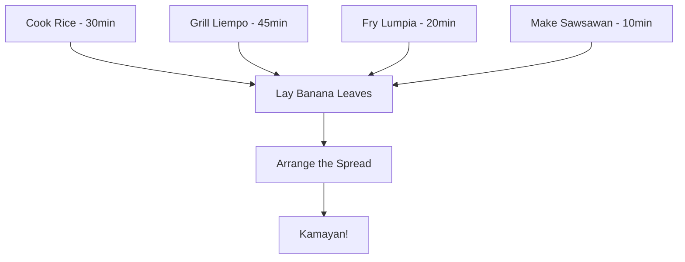

# Kamayan: Eating With Your Hands

> Kamayan is not a recipe. It's a reclamation.

The word comes from *kamay* — Tagalog for "hand." Before Spain, before forks, before table manners were imported from colonizers, Filipinos ate with their hands. Spanish and American colonial powers discouraged the practice, pushing spoons and forks as markers of civilization. Kamayan survived anyway.

## Pre-Colonial Roots

Antonio Pigafetta, chronicler of the Magellan expedition, documented Filipinos eating with their hands in 1521. The practice — *pagkakamay* — was the standard across the archipelago. It wasn't informal. It wasn't crude. It was simply how food was shared.

After centuries of colonial discouragement, kamayan re-emerged in the 1980s and 1990s as a deliberate cultural statement. Today it's both tradition and protest — a refusal to let colonialism dictate how Filipinos eat.

## The Diaspora Movement

In 2015, Chef Yana Gilbuena launched the **SALO Project** — hosting kamayan feasts across more than 20 U.S. cities, featuring regional Filipino dishes on banana leaves. SALO became a gathering place for Filipino-Americans to reconnect with the community and the homeland. The movement has since spread to Toronto, Vancouver, and beyond.

Kamayan in the diaspora is not nostalgia. It's identity.

*Cultural context from [Wikipedia](https://en.wikipedia.org/wiki/Kamayan), [Merkado PH](https://merkadoph.se/blogs/news/the-art-and-culture-of-filipino-kamayan), and [Panlasang Pinoy](https://panlasangpinoy.com/boodle-fight/) by Vanjo Merano.*

---

## Setting the Table



### The Foundation: Rice

The only non-negotiable. Place steaming mounds at intervals for easy access.

```
jasmine rice:   6 cups (for 6-8 people)
water:          6 cups (1:1 ratio, rinsed until clear)
salt:           2 pinches
```

### Inihaw Na Liempo (Grilled Pork Belly)

*Adapted from [Panlasang Pinoy](https://panlasangpinoy.com/boodle-fight/) by Vanjo Merano.*

- 1 kg pork belly, sliced into strips
- 1/2 cup soy sauce
- 1/4 cup calamansi juice
- 6 cloves garlic, minced
- 1 tbsp black pepper, coarsely ground
- 2 tbsp brown sugar
- 1 tbsp fish sauce

> Grill over **medium-high heat**, 5-7 minutes per side.

### Sawsawan (Dipping Sauces)

| Sauce | Base | Pairs With |
|---|---|---|
| Toyomansi | Soy + calamansi | Everything |
| Suka at sili | Vinegar + chili | Grilled meats |
| Bagoong | Fermented shrimp paste | Green mango, rice |
| Banana ketchup | Banana + tomato | Lumpia |

### Assembly Order

1. **Rice** in a long mound down the center
2. **Grilled meats** flanking both sides
3. **Lumpia** at the corners
4. **Sawsawan** in small bowls at intervals
5. **Calamansi halves** scattered everywhere
6. **Manggang hilaw at bagoong** — green mango with shrimp paste

## How to Eat

Scoop rice toward you. Press it into a small mound with your fingers. Add a piece of ulam. Compress into a pyramid. Lift to your mouth. Push in with your thumb.

One hand. No utensils. No apologies.

---

*The best kamayan is the one where everyone leaves with stained fingers and full stomachs.*
