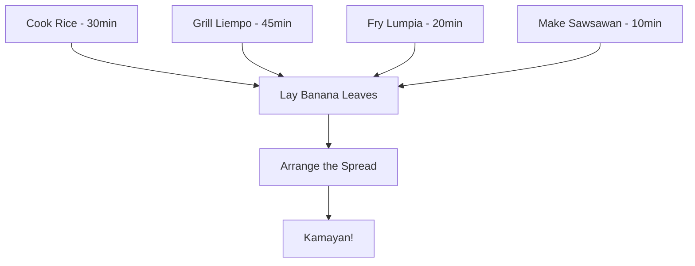

# Kamayan: A Feast Eaten With Your Hands

Kamayan is not a recipe — it's an event. A communal feast laid on banana leaves where the only utensil is your hands. The word comes from *kamay* (hand), and if you reach for a fork, someone *will* notice.

## Feast Prep Flow



## The Foundation: Rice

Everything starts and ends with rice. For a kamayan of 6-8 people:

```
jasmine rice:   6 cups
water:          6 cups (1:1 ratio, rinsed until clear)
salt:           2 pinches

garlic rice:    fry 8 cloves minced garlic in oil
                toss with cooked rice
                season with fish sauce
```

### Rice Rules

1. **Rinse** until the water runs clear — at least 3 washes
2. Use a **1:1 ratio** for jasmine (not the 1:2 your rice cooker says)
3. Let it **rest 10 minutes** after cooking, lid on
4. Fluff with a fork, never a spoon

## Grilled Liempo (Pork Belly)

The centerpiece. Marinate overnight for best results.

### Marinade

- 1 kg pork belly, sliced into strips
- 1/2 cup soy sauce
- 1/4 cup calamansi juice (or lemon)
- 6 cloves garlic, minced
- 1 tbsp black pepper, coarsely ground
- 2 tbsp brown sugar
- 1 tbsp fish sauce

> Grill over **medium-high heat**, 5-7 minutes per side. The sugar in the marinade will caramelize — watch for flare-ups.

## Sawsawan (Dipping Sauces)

No kamayan is complete without at least two sawsawan:

| Sauce | Base | Heat | Pairs With |
|---|---|---|---|
| Toyomansi | Soy + calamansi | Mild | Everything |
| Suka at sili | Vinegar + chili | Hot | Grilled meats |
| Bagoong | Fermented shrimp paste | Funky | Green mango, rice |
| Banana ketchup | Banana + tomato | Sweet | Lumpia, fries |

## Assembly

The layout matters. Follow this order on the banana leaves:

1. **Rice** in a long mound down the center
2. **Grilled meats** flanking both sides
3. **Lumpia** at the corners
4. **Sawsawan** in small bowls at intervals
5. **Fresh calamansi halves** scattered everywhere
6. **Vegetables** — grilled eggplant, tomatoes, green mango slices

## Kamayan Etiquette

- Eat with your **right hand** (traditional)
- Scoop rice toward you, press with your fingers, then lift
- Share — reach across the table, it's expected
- **No phones at the table** — this is the rule that always gets broken first

---

*The best kamayan is the one where everyone leaves with stained fingers and full stomachs.*
