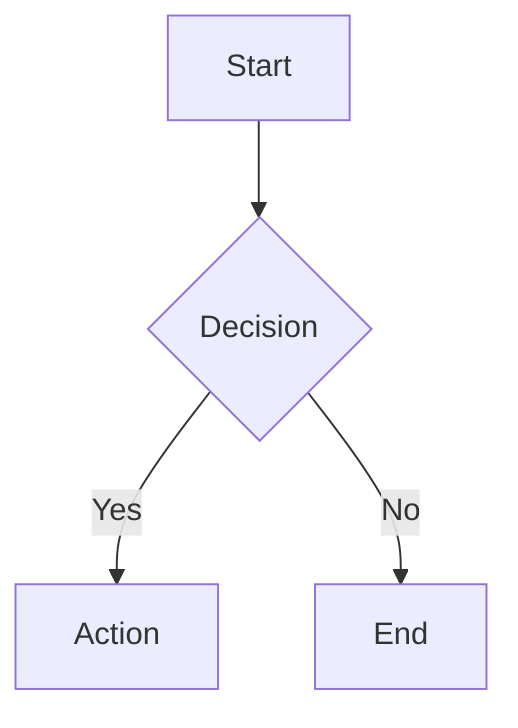
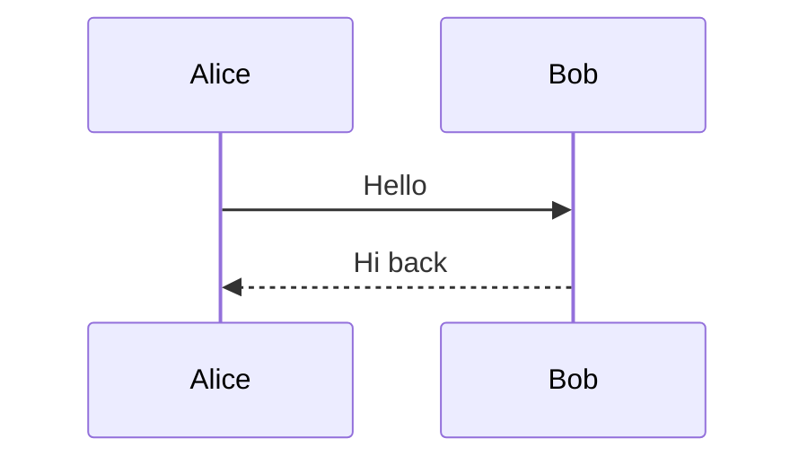
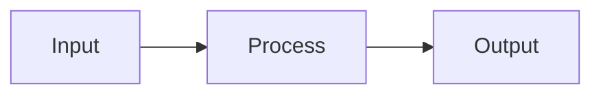

# Math & Mermaid Test Fixture

## Inline Math

The Pythagorean theorem states $x^2 + y^2 = z^2$ for right triangles.

Greek letters: $\alpha + \beta = \gamma$ and $\theta \in [0, 2\pi]$.

Adjacent math: $a$ and $b$ are variables.

Math inside bold: **the formula $E = mc^2$ is famous**.

## Display Math

$$\sum_{i=0}^n x_i^2$$

$$\int_0^\infty e^{-x} dx = 1$$

## Unsupported LaTeX

$$\begin{pmatrix} a & b \\ c & d \end{pmatrix}$$

## Mermaid Flowchart



## Mermaid Sequence Diagram



## Regular Code Block

```javascript
const x = 42
console.log(x)
```

## Non-Math Dollar Signs

The price is $5 and the cost is $10.

## Empty Math

$$$$

## The $\alpha$ Algorithm

This heading contains inline math for TOC testing.

## Mixed Content

Here is a paragraph with $\pi \approx 3.14$ inline math followed by a display equation:

$$\frac{d}{dx} e^x = e^x$$

And then a diagram:


